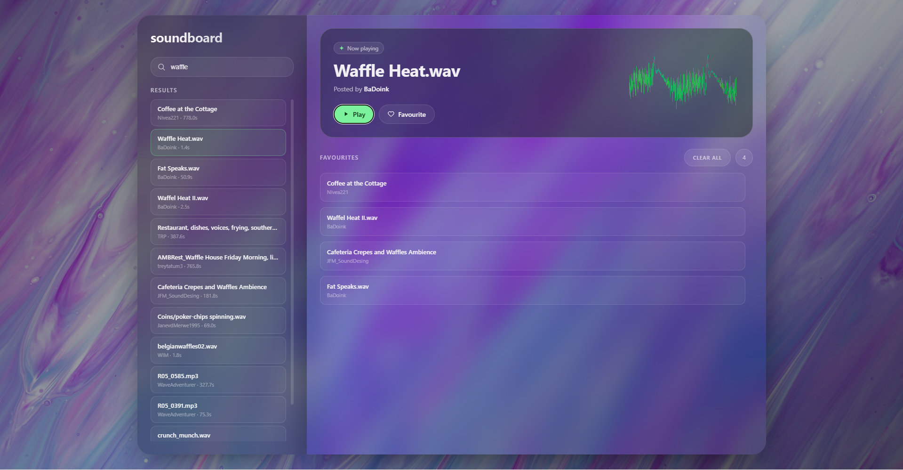

# soundboard
 
A minimalist sound explorer built on the [Freesound.org](https://freesound.org) API. Search, preview, and save your favourite sound effects — all in the browser, no dependencies.
 
Built as a first-year project for the Dynamic Web Development course at [Odisee](https://www.odisee.be) — Applied Informatics, 2025–2026.

 
## Features
 
- 🔍 Search sounds via the Freesound API
- ▶️ Play / pause directly from the now playing banner
- ❤️ Save favourites with one click, remove individually or all at once
- 💾 Favourites and last played sound persist via `localStorage`
- 🎨 Glassmorphism UI with full-screen background
## Stack
 
Vanilla HTML · CSS · JavaScript — no frameworks, no libraries.